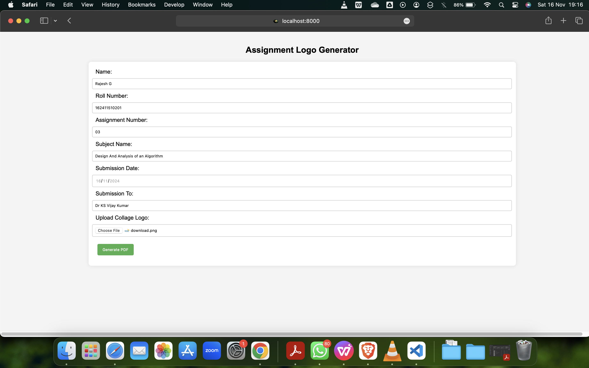
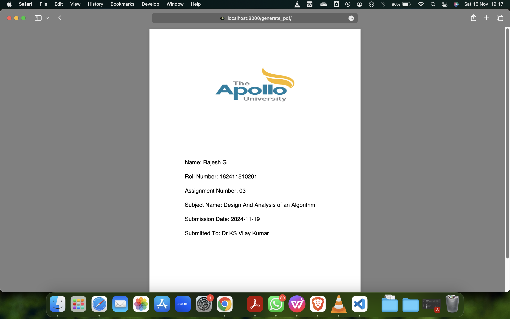

# Assignment Logo Paper Generator

A simple Django-based tool for generating customized front pages for academic assignments. This project allows users to create professionally styled assignment front pages with ease.

## Features
- Generate customized front pages for assignments.
- Add personalized details like student name, roll number, subject, and institution logo.
- Download the generated front page as a PDF or image.
- Simple and user-friendly interface.

## Tech Stack
- **Backend**: Django
- **Frontend**: HTML, CSS

## Installation
1. Clone the repository:
   ```bash
   git clone https://github.com/RAJESH2961/assignment-logo-paper-generator.git
   cd assignment-logo-paper-generator


## Screenshots
## Home Page

## Form To Enter Data

## Output (Downloadable Pdf)



